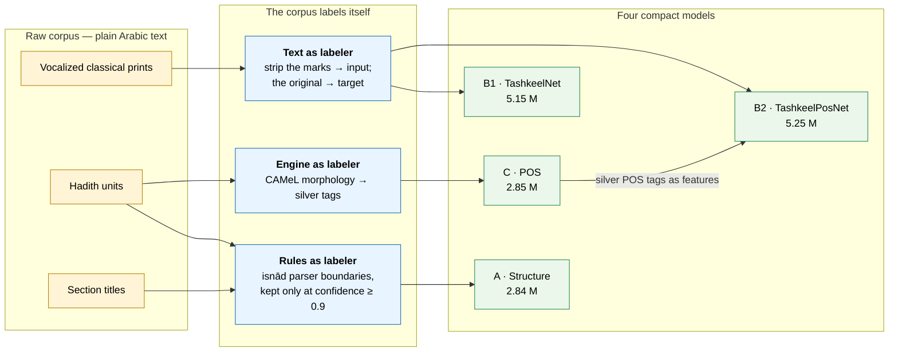

# arabicmodels

Four compact neural models for **classical Arabic** — diacritization, part-of-speech
tagging and text-structure segmentation — trained **without a single manually
labeled example**.

The largest is 5.2 M parameters and 20 MB. They run on a CPU. Every model, the
code that trained it, and the data it was trained on are in this repository.

The trick is that the corpus labels itself. Classical Arabic prints are already
vocalized, so stripping the diacritics off a page yields a perfectly aligned
(input, target) pair for free. Rule-based parsers and an existing morphological
analyzer supply the other two label sets. Full method: [`docs/PAPER.md`](docs/PAPER.md).

---

## The four models

| | Task | Params | Size | Held-out test result |
|---|---|---:|---:|---|
| **A** | Structure segmentation | 2.84 M | 11 MB | 99.96 % word accuracy; 99.75 % of chain/body boundaries within ±2 words |
| **B1** | Diacritization (characters) | 5.15 M | 20 MB | 5.12 % DER(all) · 4.16 % DER(marked) |
| **B2** | **Diacritization (characters + POS)** | 5.25 M | 20 MB | **4.46 % DER(all) · 3.51 % DER(marked)** |
| **C** | Part-of-speech tagging | 2.85 M | 11 MB | 95.87 % agreement with its teacher |

**B2 is the recommended diacritizer.** It is B1 plus a 32-dimensional POS-tag
embedding on every character, which is enough to cut the remaining errors by
~13 % at identical training cost. B1 ships alongside it as the controlled
ablation.

DER is *diacritic error rate*: the share of Arabic letters given the wrong mark.
Two numbers are reported because classical prints are only **selectively**
vocalized — DER(all) penalizes the model for marking letters the editor chose to
leave bare, DER(marked) scores only the letters the book itself marked. The
honest figure is between them.

---

## Install

```bash
git clone https://github.com/khair/khair-arabic-models
cd khair-arabic-models
git lfs install && git lfs pull        # weights + datasets are LFS objects
pip install -e .
```

`git lfs pull` is required: without it the `.pt` and `.jsonl` files are 130-byte
pointers. Check what you have with:

```bash
arabicmodels info
```

---

## Quickstart

```python
from arabicmodels import Diacritizer, PosTagger, StructureTagger

unit = ("1248 - حدثنا محمد بن بشار قال حدثنا يحيى عن عبيد الله قال حدثني نافع "
        "عن ابن عمر ان رسول الله صلى الله عليه وسلم قال من اقتنى كلبا الا كلب "
        "ماشية او ضاري نقص من عمله كل يوم قيراطان")

# 1. Separate the chain of transmission from the report body
for label, text in StructureTagger.load().segments(unit):
    print(f"[{label}] {text}")
# [HNUM ] 1248
# [ISNAD] - حدثنا محمد بن بشار قال حدثنا يحيى عن عبيد الله قال حدثني نافع عن ابن عمر ان
# [MATN ] رسول الله صلى الله عليه وسلم قال من اقتنى كلبا الا كلب ماشية او ضاري نقص من عمله كل يوم قيراطان

# 2. Restore the diacritics
Diacritizer.load().diacritize("قال رسول الله صلى الله عليه وسلم")
# 'قَالَ رَسُولُ اللَّهِ صَلَّى اللَّهُ عَلَيْهِ وَسَلَّمَ'

# 3. Tag parts of speech
PosTagger.load().tag("حدثنا قتيبة بن سعيد")
# [('حدثنا', 'verb'), ('قتيبة', 'adj'), ('بن', 'noun'), ('سعيد', 'noun_prop')]
```

### Conservative merging

When the source text is already partially vocalized and that vocalization
carries editorial authority, use `fill_gaps` instead of `diacritize`. It only
touches words that are *completely* bare, leaves every existing mark verbatim,
and never enters a Qurʾānic citation span:

```python
d = Diacritizer.load()
d.fill_gaps("قَالَ رسول الله ﴿إنا أعطيناك الكوثر﴾ وقال ابن عمر")
# 'قَالَ رَسُولُ اللهِ ﴿إنا أعطيناك الكوثر﴾ وَقَالَ ابْنُ عُمَرَ'
#  ^ kept as-is     ^ filled in      ^ untouched      ^ filled in
```

### Command line

```bash
arabicmodels tashkeel  infer --text "قال رسول الله" --pos
arabicmodels tashkeel  annotate page.txt --pos --out page.vocalized.txt
arabicmodels pos       infer --file corpus.txt
arabicmodels structure spans page1.txt page2.txt --out spans.json
arabicmodels structure eval          # reproduce the table above
```

---

## How they were trained without annotation



Three label sources, none of them a human annotator:

- **Text as labeler.** A vocalized print is its own answer key. `split_marks`
  peels the diacritics off, and the peeled marks *are* the target. This is what
  makes 70,000 training windows free.
- **Rules as labeler.** A high-precision isnād parser ([`isnad.py`](src/arabicmodels/isnad.py))
  finds the chain/body boundary. Only its confident output (≥ 0.9) becomes
  training data; the network then generalizes the same convention to the text
  the rules handle poorly.
- **Engine as labeler.** The CAMeL Tools morphological analyzer tags 4,000
  passages, and a 2.85 M-parameter student is distilled from it — small and fast
  enough to then serve as a *feature extractor* inside the B2 diacritizer.

The consequence, stated plainly: each model's accuracy is measured against **its
own label source**, not against gold human annotation. 99.96 % means the
structure model reproduces the rules; 95.87 % means the POS student reproduces
CAMeL. See [Limitations](#limitations).

---

## Datasets

Everything under [`data/`](data) is the exact data the shipped checkpoints were
trained on. Splits are 90/5/5 by deterministic content hash, so they are
reproducible and identical strings can never straddle a split.

| File | Rows | train / dev / test | Size | Labels from |
|---|---:|---|---:|---|
| `indexing.jsonl` | 48,000 | 43,209 / 2,348 / 2,443 | 28 MB | isnād parser + section titles |
| `pos.jsonl` | 4,000 | 3,637 / 182 / 181 | 7.5 MB | CAMeL morphology |
| `tashkeel.jsonl` | 70,000 | 63,015 / 3,445 / 3,540 | 47 MB | the vocalized text itself |
| `tashkeel_pos.jsonl` | 70,000 | same rows | 74 MB | the above + POS student tags |

`tashkeel_pos.jsonl` is `tashkeel.jsonl` with one extra field and is fully
regenerable — `arabicmodels tashkeel tag-data` rebuilds it in a few minutes if
you would rather not fetch 74 MB.

Provenance, licensing of the source texts, and the differences between the
shipped datasets and what [`scripts/build_datasets.py`](scripts/build_datasets.py)
produces today: [`docs/DATA.md`](docs/DATA.md).

---

## Training

The entire model family retrains in **about half an hour** on one RTX 3080.

```bash
arabicmodels structure train --epochs 3          # ~18 min
arabicmodels pos       train --epochs 4          # ~1 min
arabicmodels tashkeel  train --epochs 3          # ~7 min   (B1)
arabicmodels tashkeel  tag-data                  # tags the windows for B2
arabicmodels tashkeel  train --pos --epochs 3    # ~7 min   (B2)
```

Without `--out`, training **overwrites the shipped checkpoint**. Pass
`--out mymodels/x.pt` unless you mean to replace it.

### Adapting a model to your own texts

Fine-tuning is almost always the better option: it needs a fraction of the data
and keeps what the model already knows about Arabic.

```bash
arabicmodels tashkeel train \
    --init-from models/tashkeel_bilstm.pt \
    --data mydata/tashkeel.jsonl --out mymodels/mine.pt \
    --epochs 2 --lr 2e-4
```

On 2,257 rows and one epoch, that reaches 3.08 % dev DER, against 24.30 % for
the same data trained from scratch. Build the dataset from your own corpus
first:

```bash
python scripts/build_datasets.py --task tashkeel --input mycorpus/
```

Step-by-step instructions: [`docs/USER_GUIDE.md`](docs/USER_GUIDE.md).
Hyperparameters and architecture: [`docs/TRAINING.md`](docs/TRAINING.md).

---

## Limitations

Read these before trusting a number.

1. **Accuracy is agreement, not correctness.** Models A and C are scored against
   their label sources. A systematic error in the isnād parser or a wrong CAMeL
   analysis is reproduced by the student and counted as success.
2. **The POS teacher is context-free and MSA-trained.** It ranks analyses by
   frequency without looking at the sentence, and its database targets Modern
   Standard Arabic, not classical. Its `NOAN_PROP` backoff labels anything
   unanalyzable as a proper noun.
3. **Domain is hadith prose.** Chains of transmission, formulaic openers,
   classical vocabulary. Expect degradation on news, poetry, dialect or
   contemporary prose.
4. **Structure has a train/serve mismatch.** The model is trained on
   single hadith units but applied to whole pages in blocks of 220 words, so
   block edges are the weak spot.
5. **Near-duplicates are not removed.** Hash splitting separates *identical*
   strings only. Hadith recur across collections with small variations, so some
   test material closely resembles training material and the reported figures
   are optimistic to an unmeasured degree.
6. **Diacritization uses 16 classes.** Superscript (dagger) alef U+0670 is
   outside the inventory: `هَٰذَا` becomes `هَذَا`. Marks are also emitted
   shadda-first, which renders identically to canonical order but is not
   byte-equal — normalize with `unicodedata.normalize("NFC", …)` before
   comparing against a reference corpus.

---

## Documentation

| | |
|---|---|
| [`docs/USER_GUIDE.md`](docs/USER_GUIDE.md) | **Start here** — running, training, fine-tuning and data formats, with worked scenarios ([بالعربية](docs/USER_GUIDE.ar.md)) |
| [`docs/PAPER.md`](docs/PAPER.md) | Full method, architecture, training protocol and results |
| [`docs/MODEL_CARDS.md`](docs/MODEL_CARDS.md) | Per-model card: inputs, outputs, metrics, intended use |
| [`docs/DATA.md`](docs/DATA.md) | Dataset provenance, formats, filters, source-text licensing |
| [`docs/TRAINING.md`](docs/TRAINING.md) | Reproducing the checkpoints, and training on your own corpus |

---

## Citation

```bibtex
@techreport{khair2026corpuslabeler,
  title  = {The Corpus is the Labeler: Compact Neural Models for Structure
            Segmentation, POS Tagging, and Diacritization of Classical
            Hadith Text},
  author = {Khair, Mohammad Mohammad},
  year   = {2026},
  institution = {International Computing Institute for Quran and Islamic Sciences},
  url    = {https://github.com/khair/khair-arabic-models/blob/main/docs/PAPER.md}
}
```

## License

Apache License 2.0 — see [`LICENSE`](LICENSE). Code, model weights and
datasets are all covered.

[`NOTICE`](NOTICE) carries the attribution required by section 4(d) of the
license, plus a note on the provenance of the training texts. If you
redistribute this work or a derivative, include `NOTICE` with it.
