# The Corpus is the Labeler: Compact Neural Models for Structure Segmentation, POS Tagging, and Diacritization of Classical Hadith Text
*Author: Mohammad Mohammad Khair, MS, EMBA*
*International Computing Institute for Quran and Islamic Sciences (qurancomputing.org)*
*Manuscript v2 — 2026-09-07*

---

> **Note for readers of this repository.** This is the paper as published,
> describing the models in the context of the AdvancedHadith system they were
> built for. That system is not open source; the models, training code and
> datasets it describes are, and they live here. Two things to keep in mind
> while reading:
>
> * **Paths.** The paper refers to `Arabic-lib/arabiclib/neural/*.py` and
>   `Arabic-lib/training/build_datasets.py`. Here those are
>   `src/arabicmodels/*.py` and `scripts/build_datasets.py`; commands spelled
>   `python -m arabiclib.neural.tashkeel …` are `arabicmodels tashkeel …`.
> * **§8, Deployment.** That section describes the closed production system —
>   a PostgreSQL `passage_annotations` table, a reader UI, an ETL pipeline.
>   None of it is in this repository. The two techniques it introduces that
>   *are* here, and that are useful anywhere, are the gap-only tashkīl merge
>   (`Diacritizer.fill_gaps`) and page-level structure spans
>   (`StructureTagger.spans`).
>
> Reproduce the results with `arabicmodels {structure,pos,tashkeel} eval`; the
> figures in §7 were re-verified against this repository's checkpoints and
> datasets.

---

## Abstract

We present the neural annotation layer of AdvancedHadith (hadith.chat), a
production digital library serving 659,000 passages from 33 classical hadith
collections. Three tasks central to reading and studying hadith — (i)
segmenting page text into hadith number, isnād (chain of transmitters), matn
(report body) and section headings; (ii) part-of-speech (POS) tagging; and
(iii) diacritic restoration (tashkīl) — are solved by four compact
bidirectional-LSTM models (2.8–5.2 M parameters) trained **without a single
manually labeled example**. Labels are harvested from the corpus itself: a
high-precision rule parser supplies 40,000 sanad/matn boundaries, the
selectively vocalized text of classical prints supplies 70,000 parallel
diacritization windows, and an established morphological analyzer (CAMeL
Tools) is distilled into a database-free tagger from 4,000 passages. On
held-out test splits the structure model reaches **99.96 %** word accuracy
and places **99.75 %** of matn boundaries within ±2 words (median error 0);
the POS student agrees with its teacher on **95.87 %** of tokens; and a
POS-conditioned diacritizer attains **4.46 %** diacritic error rate (3.51 %
on letters the reference marks), a 13–16 % relative reduction over a
character-only model of identical training budget. Every model trains in
1–18 minutes on one consumer GPU (RTX 3080) and is served *offline*: outputs
are stored as versioned annotation rows and no model runs at request time.
We give the complete architectures with per-layer parameter budgets, the
exact label-harvesting filters, the shared training recipe, and a candid
account of what each metric does and does not measure, so that the
corpus-as-labeler recipe can be reproduced for other classical-text digital
libraries.

**Keywords:** hadith, classical Arabic, sequence labeling, diacritization,
knowledge distillation, weak supervision, BiLSTM, digital libraries.

---

> **How to read this paper.** Readers new to Arabic NLP should start with
> §2, which defines the terms, the tasks and the metrics, and should follow
> the *In plain terms* notes that accompany each technical section.
> Practitioners can go directly to §4 (exact data filters), §5
> (architectures with parameter budgets), §6 (training recipe), §7 (results)
> and §8 (deployment pattern). Every number in the paper can be regenerated
> with the commands in the Reproducibility section.

---

## 1. Introduction

Classical hadith collections pose a distinctive NLP problem profile. Each
report (ḥadīth) consists of an isnād — a chain of narrators — followed by the
matn, the report body; separating the two is a prerequisite for narrator
knowledge graphs, matn-level search and comparison, and reader-facing
highlighting. The texts are *selectively* vocalized: most words are printed
bare, yet readers benefit from full diacritization (tashkīl). And the
orthography and vocabulary are pre-modern, which degrades tools tuned on
Modern Standard Arabic (MSA).

Manual annotation at library scale (hundreds of thousands of passages) is
infeasible for a small team. This paper describes how the AdvancedHadith
system obtained production-grade neural annotation for three tasks with
**zero manually labeled examples**, by exploiting three label sources that
were already present in the pipeline:

1. **Rules as labeler.** A deterministic isnād parser (§4.3) locates
   sanad/matn boundaries with high precision on well-behaved pages. Its most
   confident outputs (confidence ≥ 0.9) become training labels for a neural
   model that *generalizes the same convention* to pages the rules parse
   poorly.
2. **The text as labeler.** Vocalized classical prints (e.g., the Dār
   al-Shaʿb *Ṣaḥīḥ al-Bukhārī*) are perfect parallel data for
   diacritization: stripping the marks yields the input; the original is the
   reference (§4.4).
3. **An engine as labeler.** The CAMeL Tools morphological analyzer provides
   silver POS tags that are distilled into a compact student needing no
   morphology database at inference (§4.5).

A deliberate engineering constraint shapes the model family: every model must
train in minutes on one consumer GPU and run **offline**, with the serving
tier consuming only precomputed, versioned annotations. We therefore report
strong results with small from-scratch BiLSTMs rather than large pretrained
transformers, and we quantify one architectural intervention — conditioning
the diacritizer on POS tags — with a controlled ablation.

Figure 1 shows how the pieces fit together; Table 1 summarizes the four
models.

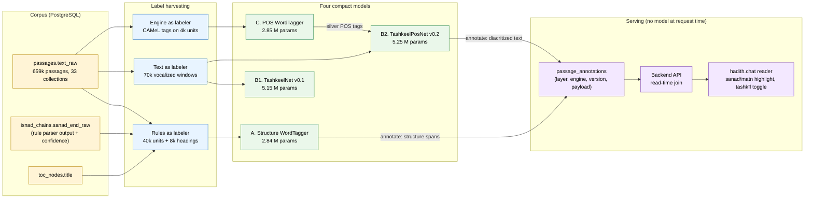

*Figure 1. End-to-end data flow. Labels come from three places the corpus
already "knows" the answer; four small models are trained offline; only
their stored outputs are served.*

> **In plain terms.** Nobody sat down and labeled hadiths for these models.
> We looked for places where the corpus already contained the answer — a
> rule program that finds where the chain of narrators ends, printed books
> whose vowel marks are already there, and a dictionary-based analyzer that
> already tags words — and used those answers as training data. The neural
> networks then learn to reproduce those answers everywhere, including on
> pages the original sources could not handle.

**Table 1. The four models at a glance.**

| | A. Structure | C. POS | B1. Tashkeel v0.1 | B2. Tashkeel v0.2 |
|---|---|---|---|---|
| Checkpoint | `indexing_wordtagger.pt` (v0.2) | `pos_wordtagger.pt` (v0.1) | `tashkeel_bilstm.pt` (v0.1) | `tashkeel_bilstm_pos.pt` (v0.2) |
| Predicts one label per | word | word | Arabic letter | Arabic letter |
| Input | words as character sequences (≤ 18 chars/word), ≤ 220 words | same, ≤ 120 words | characters of a window ≤ 380 chars | characters + POS tag of the word |
| Output classes | 4 (+ pad, unk) | 24 (+ pad, unk) | 16 | 16 |
| Network | char-BiLSTM word encoder → 2-layer word BiLSTM | identical topology | 2-layer character BiLSTM | same, with a 160-d input (128 char + 32 tag) |
| Parameters | 2,836,678 | 2,846,170 | 5,146,256 | 5,245,328 |
| Checkpoint size (fp32) | 11.35 MB | 11.39 MB | 20.59 MB | 20.99 MB |
| Label source | rule parser + tables of contents | CAMeL analyzer (silver) | vocalized prints | vocalized prints + POS student tags |
| Training examples | ≈ 43k units and headings | 3,637 units | 63,015 windows | 63,015 windows |
| Headline test metric | 99.96 % word acc.; 99.75 % boundaries within ±2 words | 95.87 % agreement with teacher | 5.12 % DER | **4.46 % DER** |
| Production role | sanad/matn spans; fills missing unit boundaries | feature extractor for B2 | ablation baseline (not deployed) | production tashkīl layer |

**Contributions.** (1) A corpus-as-labeler methodology instantiated on three
tasks in one production system; (2) four compact, fully reproducible models
with complete training recipes and CLIs; (3) a controlled ablation showing
that grammar conditioning reduces diacritization error by 13–16 % relative at
no additional training cost; (4) a deployment pattern (offline annotation,
versioned rows, gap-only merge) suitable for conservative digital-library
settings; (5) an explicit account of the measurement caveats that come with
harvested labels, so results are read neither too generously nor too
harshly.

## 2. Background and Terminology

### 2.1 Anatomy of a hadith unit

A printed hadith unit typically has three parts, preceded on many pages by a
section heading. Table 2 shows a real unit from the corpus, labeled exactly
as the structure model labels it (this is the model's own output, §7.1).

**Table 2. A hadith unit and its structure labels.**

| Part | Label | Text |
|---|---|---|
| Printed hadith number | `HNUM` | 1248 |
| Chain of transmitters (isnād / sanad) | `ISNAD` | - حدثنا محمد بن بشار قال حدثنا يحيى عن عبيد الله قال حدثني نافع عن ابن عمر ان |
| Report body (matn) | `MATN` | رسول الله صلى الله عليه وسلم قال من اقتنى كلبا الا كلب ماشية او ضاري نقص من عمله كل يوم قيراطان |
| Section title (elsewhere on the page) | `HEADING` | كتاب … / باب … / فصل … |

The isnād is built from transmission verbs (حدثنا "he narrated to us",
أخبرنا "he informed us", عن "on the authority of") and personal names. The
boundary with the matn is where narration stops and the reported speech or
event begins. Where exactly to cut is partly a *convention*: the corpus's
rule parser keeps the introducing «أنّ» ("that") inside the sanad, and the
neural model learns the same convention.

### 2.2 Arabic diacritics and why restoration is hard

Arabic script writes consonants and long vowels; short vowels and consonant
doubling are indicated by optional marks (diacritics, *tashkīl*). The same
bare letters كتب read as كَتَبَ "he wrote", كُتِبَ "it was written" or كُتُبٌ
"books". Case endings are equally invisible: in «قَالَ رَسُولُ اللهِ» the subject
takes ḍamma (-u), while in «عَنْ رَسُولِ اللهِ» the same word after a preposition
takes kasra (-i). Only grammar decides — which is the motivation for feeding
POS tags to the diacritizer (§5.3).

Diacritization is cast here as *classification of every Arabic letter* into
one of 16 classes: eight vowel states × with/without shadda (Table 3).

**Table 3. The 16 diacritic classes predicted per letter.**

| Mark | Name | Unicode | Class id without shadda | Class id with shadda |
|---|---|---|---:|---:|
| (none) | bare letter | — | 0 | 8 |
| ◌َ | fatḥa | U+064E | 1 | 9 |
| ◌ُ | ḍamma | U+064F | 2 | 10 |
| ◌ِ | kasra | U+0650 | 3 | 11 |
| ◌ْ | sukūn | U+0652 | 4 | 12 |
| ◌ً | fatḥatān | U+064B | 5 | 13 |
| ◌ٌ | ḍammatān | U+064C | 6 | 14 |
| ◌ٍ | kasratān | U+064D | 7 | 15 |

Shadda (◌ّ, U+0651) marks a doubled consonant and combines with any vowel
state, hence the +8 offset. Two points matter for reading the results:

- Class 0 is *linguistically real*, not only missing data: letters of
  prolongation (ا و ي used as long vowels) carry no mark even in fully
  vocalized text. A large share of letters in any Arabic text is correctly
  bare.
- Classical prints are *selectively* vocalized: editors mark the letters
  they judge ambiguous and leave the rest bare. A bare letter in the
  reference therefore means either "no mark belongs here" or "the editor did
  not bother". This ambiguity is why we report two error rates (§2.5).

The superscript alif (◌ٰ, U+0670) is stripped from references but is not
among the predicted classes; the model never emits it. This is a known
simplification affecting a handful of words (e.g., الرحمٰن).

### 2.3 Sequence labeling with bidirectional LSTMs

All four models are *sequence labelers*: given a sequence of items (words or
characters) they output one class per item. The workhorse is the
bidirectional long short-term memory network (BiLSTM; Hochreiter &
Schmidhuber, 1997; Graves & Schmidhuber, 2005). One LSTM reads the sequence
left-to-right and another right-to-left; at every position the two hidden
states are concatenated, so each item's representation summarizes *both* its
left and right context. A linear layer then maps that representation to
class scores, and the highest score is the prediction.

> **In plain terms.** Think of two readers going through a sentence in
> opposite directions and, at each word, writing down what they have
> understood so far. Combining their notes at a word gives a summary of
> everything before *and* after it. A final small "decision layer" turns that
> summary into a label. No word is judged in isolation.

Two of the models (structure, POS) label words but never look up a word in
a vocabulary. Instead, each word is *spelled out* to a small character-level
BiLSTM that produces a 256-dimensional word vector from its letters (Ling et
al., 2015; Lample et al., 2016). Unseen words — rare classical forms, proper
names, spelling variants — still receive meaningful vectors because the
letter patterns (حدث-, -نا, ابن, أبو) are familiar. This is what makes the
models robust to out-of-vocabulary (OOV) words without any pretrained
embeddings.

### 2.4 Weak supervision, silver labels and distillation

- **Weak supervision** trains a model from labels produced by imperfect but
  cheap sources — rules, heuristics, other models — rather than by human
  annotators (Ratner et al., 2017). Such labels are called **silver**
  (as opposed to human **gold**).
- **Knowledge distillation** trains a small *student* model to imitate a
  larger or more expensive *teacher* (Hinton et al., 2015). Here the teacher
  is a morphological analyzer with a lexical database; the student is an
  11 MB network that needs nothing but its checkpoint.
- **Rules → neural** distillation is the same idea with a deterministic
  teacher: the neural model absorbs the rules' decision *convention* and
  extends it to inputs the rules cannot parse.

The consequence, stressed throughout this paper, is that a model trained on
silver labels is evaluated *against silver labels*. High agreement means the
student reproduces its teacher; it bounds, but does not equal, agreement
with linguistic truth.

### 2.5 Metrics

All metrics are computed on a **test split never seen in training** (§4.6).

```text
Word accuracy      = words whose predicted label equals the reference label
                     ------------------------------------------------------
                     all (non-padding) words

Boundary within ±2 = units whose first predicted MATN word lies within
                     2 positions of the first reference MATN word
                     ------------------------------------------------------
                     all units containing both ISNAD and MATN
                     (a unit with no predicted MATN word counts as a miss)

Median boundary error = median over units of |predicted − reference| in words

Teacher agreement  = tokens whose predicted tag equals the teacher's tag
                     ------------------------------------------------------
                     all tokens

DER(all)           = Arabic letters whose predicted class ≠ reference class
                     ------------------------------------------------------
                     all Arabic letters (U+0621–U+064A) in the window

DER(marked)        = same numerator, restricted to letters whose reference
                     class is not 0 (i.e., the editor wrote a mark there)
```

The two diacritic error rates (DER) bracket the truth. DER(all) treats every
bare reference letter as "no mark", so it *penalizes* the model for adding a
linguistically correct mark the editor omitted. DER(marked) scores only the
letters the editor marked, so it measures how faithfully the model reproduces
the editor's marks and says nothing about letters left bare. The true error
on a fully vocalized reference would lie between the two.

## 3. Related Work

Arabic diacritization has been approached with maximum-entropy models
(Zitouni et al., 2006), recurrent networks (Belinkov & Glass, 2015),
sequence-to-sequence models (Mubarak et al., 2019) and deep BiLSTM systems
such as Shakkelha (Fadel et al., 2019), with pretrained byte-level
transformers (ByT5; Xue et al., 2022) as a recent option. Darwish et al.
(2017) showed that *case endings* — the marks on the last letter of a word,
governed by syntax — dominate the residual error of character-level systems,
which directly motivates our POS-conditioned variant. Arabic POS and
morphology are served by analyzers and taggers such as MADAMIRA (Pasha et
al., 2014), Farasa (Abdelali et al., 2016), AlKhalil Morpho Sys 2
(Boudchiche et al., 2017) and CAMeL Tools (Obeid et al., 2020); pretrained
models specialized for classical Arabic include CAMeLBERT-CA (Inoue et al.,
2021). Hadith-specific segmentation of isnād vs. matn has been explored with
rule-based and classical machine-learning methods on individual collections
(Boella et al., 2011; Harrag, 2014).

Character-level word encoders inside BiLSTM taggers were established by Ling
et al. (2015) and Lample et al. (2016); weak supervision as a programming
model for training data by Ratner et al. (2017); and knowledge distillation
by Hinton et al. (2015). Our contribution is not a new architecture but a
*system recipe*: weakly supervised label harvesting from a large in-house
corpus, tiny task models trained from scratch, an explicit rules→neural path
for structure and an engine→neural path for POS, a grammar-conditioning
ablation for diacritization — all evaluated on held-out splits of the very
corpus the system serves.

## 4. Corpus and Label Sources

### 4.1 The corpus

The system ingests 659k passages across 33 hadith collections from two
sources (the Shamela library's page archives and a structured hadith
database), all stored in PostgreSQL. For the models, three tables matter:
`passages` (raw page or unit text), `isnad_chains` (the rule parser's
sanad/matn boundary per chain, with a confidence score) and `toc_nodes`
(section titles). One script, `Arabic-lib/training/build_datasets.py`,
turns them into three JSONL datasets (Figure 2, Table 5).

### 4.2 Three label sources

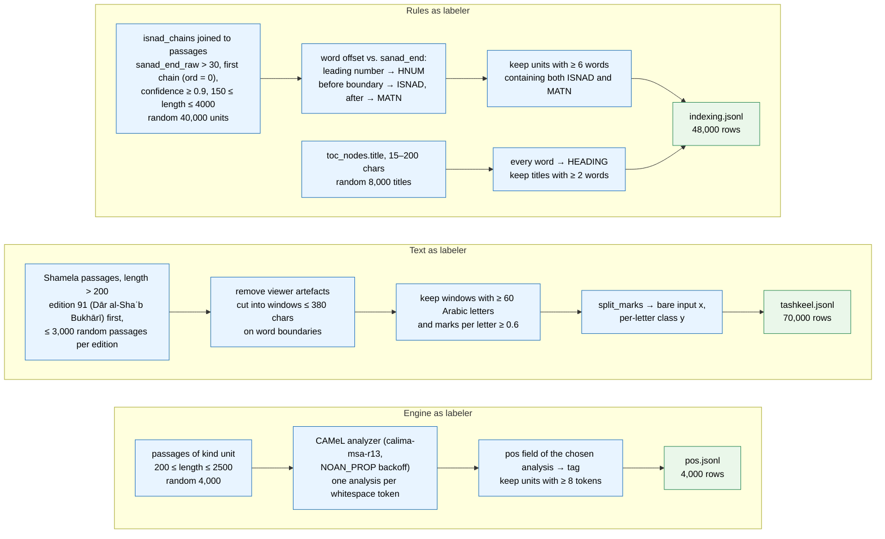

*Figure 2. Exact selection and labeling rules of the three datasets, as
implemented in `build_datasets.py`.*

### 4.3 Rules as labeler — structure labels

The deterministic isnād parser (`arabiclib.isnad.parse_isnad`) locates the
sanad/matn boundary through transmission-verb and name-mention patterns and
stores `sanad_end_raw` (a character offset into the raw text) with a
confidence score for each chain of each unit. Training uses only the parser's
*most confident* decisions: first-chain boundaries with confidence ≥ 0.9 and
offset > 30 characters, on units of 150–4,000 characters — 40,000 units
sampled at random. Labeling is a pure function of the offset:

```text
for each whitespace word w at character offset o (first 220 words):
    if w is a bare number (Arabic-Indic or Western digits, optional
       trailing dash/dot/bracket) and it is the first word → HNUM
    elif o < sanad_end_raw                        → ISNAD
    else                                          → MATN
```

Units are kept only if they have ≥ 6 words and contain both `ISNAD` and
`MATN`. To teach the model what a section title looks like, 8,000 table-of-
contents titles (15–200 characters, ≥ 2 words) are added with every word
labeled `HEADING`. Row format:
`{"text": "9077 - حدثنا المقدام ...", "sanad_end": 127, "split": "train"}`.

Because the labels *are* the rules' convention, the model is trained to
reproduce that convention; its intended value is to carry it to pages the
rules parse poorly and to supply a per-token confidence that can queue pages
for review (§8.3, §10).

### 4.4 Text as labeler — diacritization labels

Vocalized prints are a gift: the reference is the text itself. The builder
walks Shamela editions with the fully vocalized Dār al-Shaʿb *Bukhārī*
(edition 91) first, so that its clean tashkīl forms a large share of the
data; samples up to 3,000 passages longer than 200 characters per edition;
strips viewer artefacts; and cuts each passage into windows of at most 380
characters on word boundaries. A window is kept only if it has ≥ 60 Arabic
letters **and** at least 0.6 diacritic marks per letter — a per-window
density filter that admits the densely vocalized passages of any edition
while excluding bare ones. Collection stops at 70,000 windows.

Each window is then decomposed by `split_marks` into the bare text (the
model's input) and one class per character (the target, Table 3); the
inverse `apply_marks` re-inserts predicted marks after the corresponding
letters and never touches the letters themselves (Figure 3).

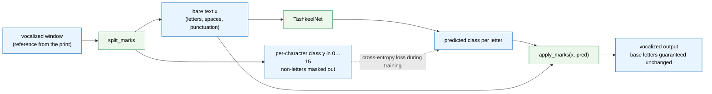

*Figure 3. The diacritization round trip. Because the model only chooses a
mark class per letter, it cannot alter, drop or insert a letter — a safety
property that matters for sacred text.*

**Table 4. Worked example of label extraction (`split_marks`).**

| Vocalized word | Bare input | Per-letter classes (Table 3) | Reading |
|---|---|---|---|
| قَالَ | ق ا ل | 1, 0, 1 | q-a, long ā (bare), l-a |
| مُحَمَّدٌ | م ح م د | 2, 1, 9, 6 | m-u, ḥ-a, m + shadda + a, d + -un |

> **In plain terms.** Take a page that already has its vowel marks. Remove
> the marks and remember, for each letter, which mark was removed. Now you
> have a question (the bare letters) and its answer key (the marks) — a
> perfect training pair — for free. Seventy thousand such snippets were
> collected.

### 4.5 Engine as labeler — POS labels

The teacher is the CAMeL Tools morphological analyzer (Obeid et al., 2020)
with the MSA database `calima-msa-r13` and the `NOAN_PROP` backoff (unknown
words are analyzed as proper nouns). For each whitespace token of 4,000
random hadith units (200–2,500 characters), the engine returns its analyses
ranked by frequency and the wrapper takes the first; its intended preference
for an analysis matching the token's existing diacritics is inactive in the
shipped version, because the comparison normalizes diacritics away. The
`pos` field of the chosen analysis becomes the tag. Units with ≥ 8 tokens are
kept. The 24 tags observed are listed in Appendix B.

Two properties of the teacher shape everything downstream: it is a
**context-free, most-frequent-analysis** tagger (not a sentence-level
disambiguator), and its database is **MSA**, not classical Arabic. The
student is a sentence-level BiLSTM, so it sees more context than the teacher
used; but it is trained to imitate the teacher's choices, and its accuracy is
measured as agreement with them (§7.2).

### 4.6 Splits and dataset statistics

Every row is assigned to train/dev/test by a deterministic MD5 hash modulo
100 (< 90 train, < 95 dev, else test). The hash key is the **window text**
for tashkīl and the **passage or TOC-node id** for structure and POS. The
procedure is reproducible and guarantees that identical strings never
straddle splits; it does not deduplicate *near*-identical texts, a caveat
discussed in §10.

**Table 5. Datasets produced by `build_datasets.py`.**

| Dataset | Rows | Train / dev / test rows | Test size (scored units) | Label source |
|---|---:|---|---|---|
| `indexing.jsonl` | 48,000 | ≈ 43.3k / 2.4k / 2.3k | 174,404 words, 2,033 boundaries (v0.2 build) | rule parser + TOC |
| `pos.jsonl` | 4,000 | 3,637 / 182 / 181 | 19,025 tokens | CAMeL analyzer |
| `tashkeel.jsonl` | 70,000 | 63,015 / 3,445 / 3,540 | ≈ 605k Arabic letters | vocalized text |
| `tashkeel_pos.jsonl` | 70,000 | same rows and splits | same | vocalized text + POS student tags |

The indexing dataset is a random sample, so a regeneration between the v0.1
and v0.2 runs produced a slightly different test set (181k words / 1,903
boundaries for v0.1; 174,404 / 2,033 for v0.2). `tashkeel_pos.jsonl` is
`tashkeel.jsonl` with one extra field: the POS student's tag for every word
of the bare text (produced by `tashkeel tag-data`, §5.4).

## 5. Models

### 5.1 Design constraints and the choices they force

**Table 6. Constraints → architectural decisions.**

| Constraint | Decision |
|---|---|
| Train in minutes on one 12 GB consumer GPU | small from-scratch BiLSTMs (2.8–5.2 M parameters); no pretrained transformer |
| No manual labels | tasks framed as token classification so harvested labels apply directly |
| Sacred text must not be corrupted | diacritizer predicts *marks per letter* only; letters are never generated |
| Serving tier is CPU-only and deterministic | models never run at request time; outputs stored as versioned rows |
| Classical orthography, many rare names | character-level word encoders, no word vocabulary |
| Auditable decisions | per-token labels with confidences, not free-text generation |

### 5.2 WordTagger — the shared word-level architecture (models A and C)

`WordTagger` (in `arabiclib/neural/common.py`) is a two-level BiLSTM
(Figure 4). Level one turns each word into a vector from its characters;
level two reads the sequence of word vectors in both directions and
classifies every word.

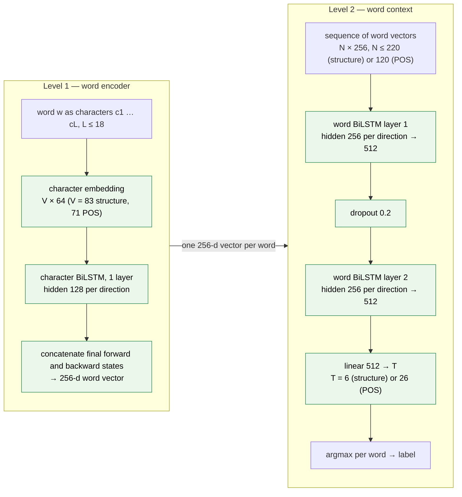

*Figure 4. `WordTagger`. Level 1 runs once per word (on batch × words
character sequences of ≤ 18 symbols) and is shared by all words; level 2
runs once per unit and sees the whole sequence, so a boundary decision can
use evidence from both the name-dense chain before it and the narrative
after it.*

Design notes:

- **Word truncation.** Only the first 18 characters of a word are encoded;
  Arabic words are rarely longer, and the tail carries little signal.
- **Tensor shapes.** Input `(batch, words, chars)` → word vectors
  `(batch, words, 256)` → contextual states `(batch, words, 512)` → logits
  `(batch, words, T)`.
- **Two output heads, one body.** The structure model (A) has T = 6
  (`HNUM`, `ISNAD`, `MATN`, `HEADING`, pad, unk) and the POS model (C) has
  T = 26 (24 tags, pad, unk). Both are the same class with different
  vocabularies; they differ by 9,492 parameters (a slightly larger character
  vocabulary and head).

**Table 7. Parameter budget of `WordTagger` (structure model; the POS model
differs only in the embedding table and head).**

| Component | Shape | Parameters | Share |
|---|---|---:|---:|
| Character embedding | 83 × 64 | 5,312 | 0.2 % |
| Character BiLSTM | in 64, hidden 128, 2 directions | 198,656 | 7.0 % |
| Word BiLSTM, layer 1 | in 256, hidden 256, 2 directions | 1,052,672 | 37.1 % |
| Word BiLSTM, layer 2 | in 512, hidden 256, 2 directions | 1,576,960 | 55.6 % |
| Classification head | 512 × 6 + 6 | 3,078 | 0.1 % |
| **Total** | | **2,836,678** | 100 % |

Because the vocabulary is *characters*, the embedding table is negligible;
93 % of the capacity sits in the two word-level BiLSTM layers (derivation in
Appendix A).

> **In plain terms.** The model never memorizes whole words. It reads each
> word letter by letter, forms an impression of it, then reads the sequence
> of impressions forwards and backwards before deciding, for each word,
> whether it belongs to the number, the chain, the body or a heading. A name
> it has never seen still "looks like a name" from its letters.

### 5.3 TashkeelNet v0.1 and TashkeelPosNet v0.2 (models B1 and B2)

The diacritizer is a character-level BiLSTM over a window of at most 380
characters (Figure 5). Every character receives a 128-d embedding; two
BiLSTM layers with 384 hidden units per direction produce a 768-d state per
character; a linear head scores the 16 classes. The loss and the output are
evaluated only on Arabic letters (U+0621–U+064A); spaces, punctuation,
digits and Latin characters are masked.

**v0.2 adds grammar.** Before the diacritizer runs, the POS student (model
C) tags every word of the bare window. Each word's tag is *broadcast* to all
of its characters and embedded into 32 dimensions; the character embedding
and the tag embedding are concatenated into a 160-d input. Nothing else
changes: same depth, same hidden size, same data, same epochs — a controlled
ablation of one factor.

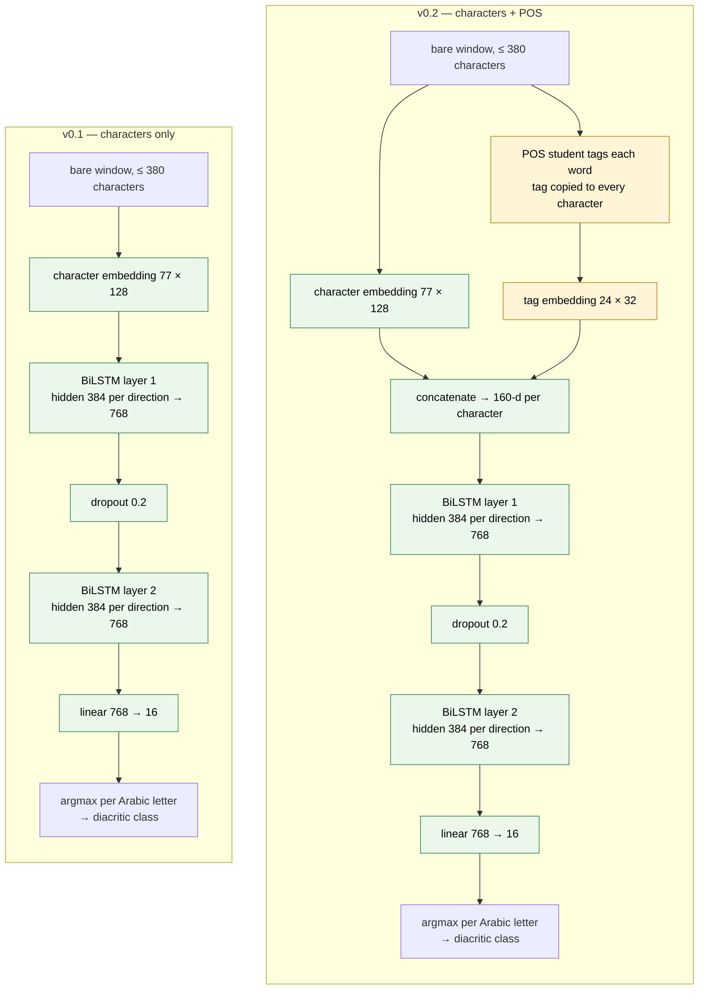

*Figure 5. The two diacritizers: TashkeelNet v0.1 (5,146,256 parameters,
left) and TashkeelPosNet v0.2 (5,245,328, right). The only difference is the
32-d POS embedding concatenated to every character in v0.2 (yellow); the
extra 99,072 parameters are the tag table plus the wider first-layer input.*

**Table 8. Parameter budget of the diacritizers.**

| Component | v0.1 | v0.2 |
|---|---:|---:|
| Character embedding 77 × 128 | 9,856 | 9,856 |
| POS-tag embedding 24 × 32 | — | 768 |
| BiLSTM layer 1 (in 128 / 160, hidden 384 × 2) | 1,579,008 | 1,677,312 |
| BiLSTM layer 2 (in 768, hidden 384 × 2) | 3,545,088 | 3,545,088 |
| Head 768 × 16 + 16 | 12,304 | 12,304 |
| **Total** | **5,146,256** | **5,245,328** |

The tag table has 24 rows: pad, unk and the 22 POS tags that occur in the
tashkīl training windows. 99.6 % of the parameters are in the two recurrent
layers.

> **In plain terms.** Version 0.1 guesses vowels from the surrounding
> letters alone. Version 0.2 is first told, for every word, whether it is a
> noun, a verb, a preposition, a proper name, and so on — the kind of
> information a grammar student uses to decide the case ending — and then
> guesses the vowels. The extra information costs almost nothing (2 % more
> parameters, same training time) and removes 13–16 % of the errors (§7.3).

### 5.4 The distillation chain

Model C is trained once from the CAMeL teacher and then reused twice: to tag
the 70,000 tashkīl windows for training v0.2 (`tashkeel tag-data`), and at
inference to tag the bare text that v0.2 diacritizes (Figure 6). The teacher
is never needed after the POS dataset is built.

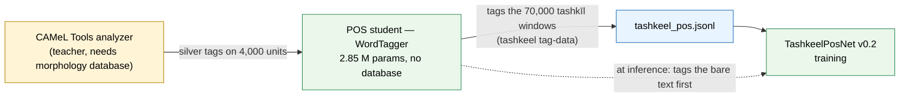

*Figure 6. Silver-label chain. Errors can compound along it (teacher →
student → diacritizer features), which makes the measured v0.2 gain a
conservative estimate of what gold grammar would provide.*

## 6. Training and Evaluation Protocol

### 6.1 One recipe, four models

All models share a single training loop (Figure 7) and differ only in a few
hyperparameters (Table 9). Vocabularies are built from the training split
only; padding positions are excluded from the loss with `ignore_index = −100`;
the dev split is evaluated after every epoch and the checkpoint with the best
dev metric is kept. There is no learning-rate schedule, warm-up or early
stopping beyond best-checkpoint selection.

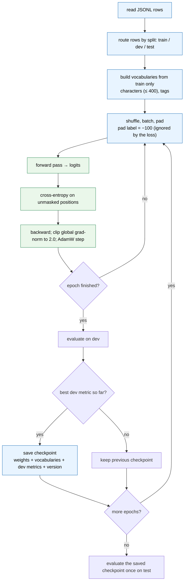

*Figure 7. The shared training loop (`train` subcommand of each module).*

**Table 9. Hyperparameters.**

| | A. Structure | C. POS | B1 / B2. Tashkeel |
|---|---|---|---|
| Optimizer | AdamW (Loshchilov & Hutter, 2019), PyTorch defaults otherwise | same | same |
| Learning rate (constant) | 1e-3 | 1e-3 | 2e-3 |
| Batch size (train / eval) | 32 / 64 | 32 / 64 | 64 / 128 |
| Epochs | 3 | 4 | 3 (both versions) |
| Loss | cross-entropy, pad ignored | same | cross-entropy, pad **and non-Arabic characters** ignored |
| Gradient clipping | global norm 2.0 | same | same |
| Dropout | 0.2 between word-BiLSTM layers | same | 0.2 between BiLSTM layers |
| Max sequence | 220 words, 18 chars/word | 120 words | 380 characters |
| Character vocabulary (incl. pad, unk) | 83 | 71 | 77 |
| Checkpoint selection | highest dev word accuracy | highest dev accuracy | lowest dev DER(all) |
| Random seed | 13 | 13 | 13 |

### 6.2 Hardware and cost

One NVIDIA GeForce RTX 3080 (12 GB), CUDA 12.4, PyTorch 2.6.0+cu124
(Paszke et al., 2019). Measured cost: ≈ 5.5 min/epoch for structure (18 min
for the final 3-epoch run with the GPU to itself), ≈ 15 s/epoch for POS,
≈ 2.2 min/epoch for each tashkīl version (Figure 8). The whole model family
retrains in about half an hour.

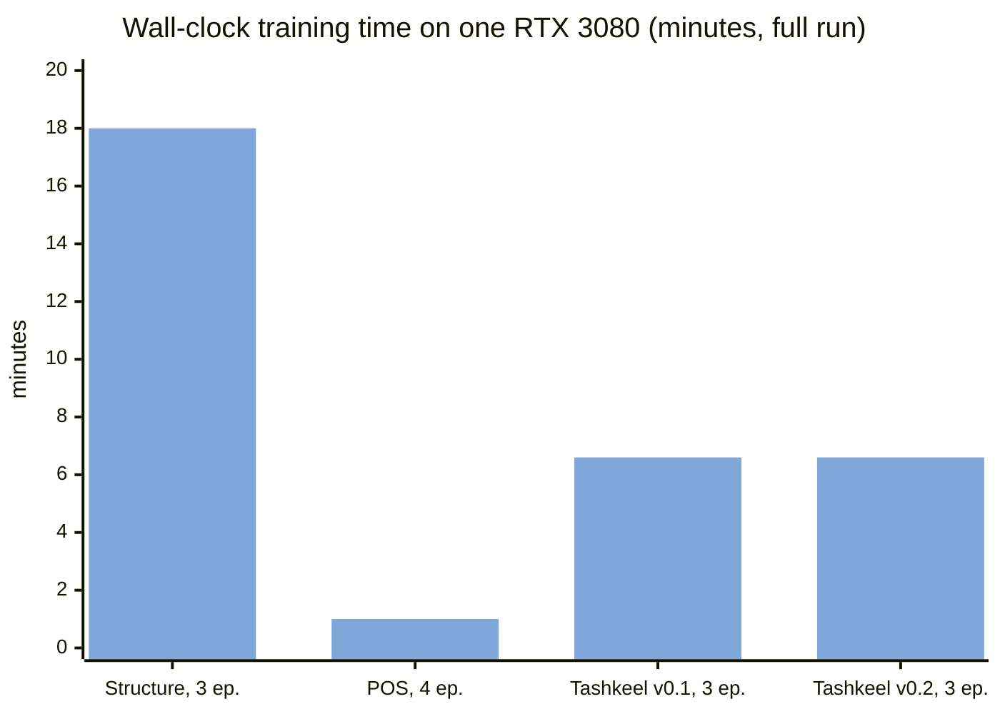

*Figure 8. Training cost per model.*

### 6.3 Evaluation protocol

The dev split is used for checkpoint selection, so dev figures are slightly
optimistic; the test split is evaluated exactly once with the selected
checkpoint and is never used for any decision. Test sizes are given in
Table 5. All results are single runs with seed 13; no seed variance was
measured (§10). Metric definitions are in §2.5.

> **In plain terms.** The model is graded on questions it has never seen
> (the test split). A separate practice set (dev) is used only to decide
> which saved version of the model to keep.

## 7. Results

### 7.1 Structure segmentation (model A)

**Table 10. Structure model on the held-out test split.**

| Metric | v0.2 (shipped) | v0.1 (earlier build) |
|---|---:|---:|
| Test words / boundaries | 174,404 / 2,033 | 181k / 1,903 |
| Word accuracy | **99.96 %** | 99.91 % |
| Matn boundary within ±2 words | **99.75 %** | 99.79 % |
| Median boundary error (words) | **0** | 0 |

At 99.96 % word accuracy, roughly 70 of 174,404 test words are mislabeled,
and about 5 of 2,033 boundaries fall more than two words from the reference
(counts derived from the rounded rates). Dev accuracy climbed 97.97 % →
99.56 % → 99.95 % over the three epochs (Figure 9): most of the task is
learned in the first epoch, and the remaining epochs resolve the boundary
convention precisely.

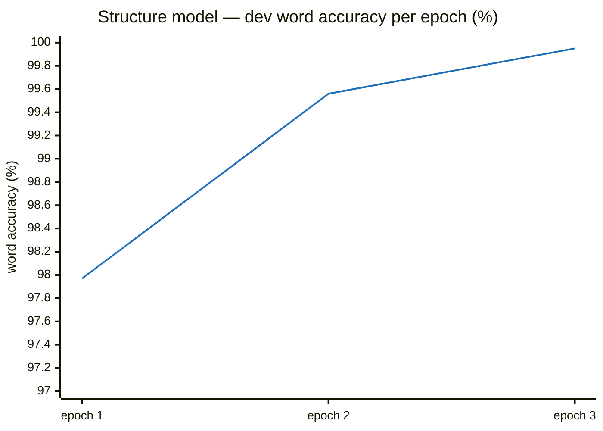

*Figure 9. Learning curve of the structure model (dev split).*

The model reproduces the extractor's boundary convention exactly. On the
unit of Table 2 it emits:

```text
[HNUM]  1248
[ISNAD] - حدثنا محمد بن بشار قال حدثنا يحيى عن عبيد الله قال حدثني نافع عن ابن عمر ان
[MATN]  رسول الله صلى الله عليه وسلم قال من اقتنى كلبا الا كلب ماشية او ضاري نقص من عمله كل يوم قيراطان
```

The introducing «أنّ» stays in the sanad, as in the rules. Two readings of
the 99.96 % are both correct: the model has learned the rules' decision
function almost perfectly (a *ceiling* result on this label source), and the
result says nothing yet about pages where the rules fail — the population
the model exists to serve. That population is assessed qualitatively so far
(§8.3, §10).

### 7.2 POS tagging (model C)

**Table 11. POS student vs. its CAMeL teacher on 19,025 test tokens.**

| Metric | Value |
|---|---:|
| Token agreement with teacher | **95.87 %** |
| Dev agreement, epoch 1 → 4 | 84.59 % → 95.75 % |
| Disagreements (derived) | ≈ 786 tokens |
| noun ↔ verb | 293 |
| noun_prop ↔ noun | 171 |
| adj → noun | 117 |

Three confusion types account for about three quarters of all disagreements
(Figure 10), and all three are the classic ambiguities of unvocalized
script: the same bare letters can be noun or verb (كتب), proper names are
ordinary nouns or adjectives in form (الزهري), and nisba adjectives are used
as names.

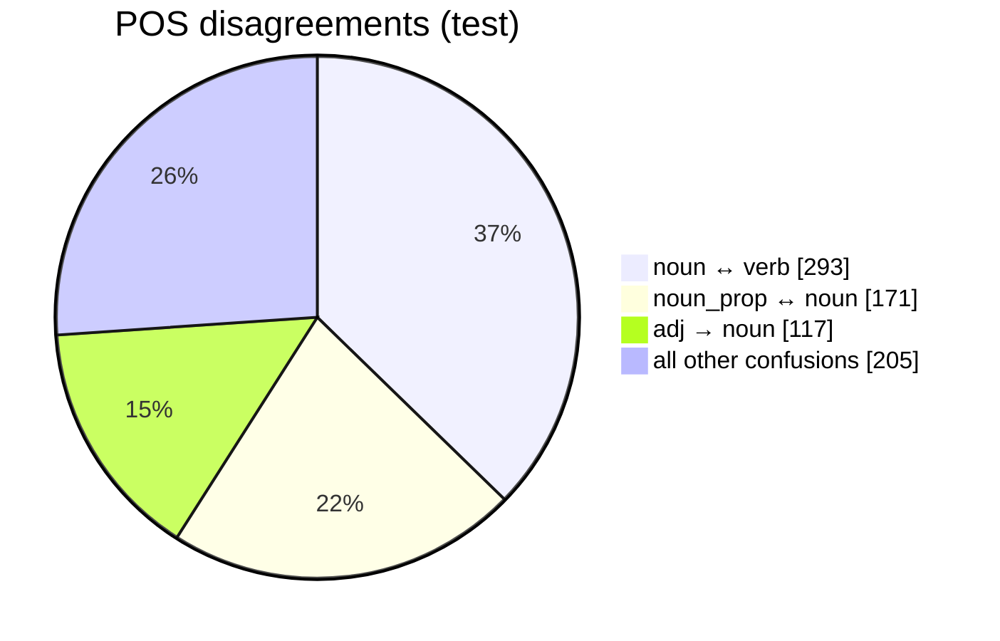

*Figure 10. Composition of student–teacher disagreements. "All other" is
derived as total disagreements minus the three reported classes.*

Example output:

```text
حدثنا/verb قتيبة/noun_prop بن/noun سعيد/noun_prop قال/verb حدثنا/verb سفيان/noun_prop عن/prep الزهري/adj
```

Note الزهري/adj: the nisba is tagged as an adjective because that is the
teacher's convention. The 95.87 % is agreement with a context-free, MSA-
database teacher (§4.5); some "disagreements" may be the sentence-level
student being right where the frequency-ranked teacher is wrong, and the
reverse also occurs. The figure bounds *agreement*, not correctness.

### 7.3 Diacritization and the grammar-conditioning ablation (models B1, B2)

**Table 12. Diacritic error rate (lower is better); 3,540 test windows,
≈ 605k scored letters; identical data, splits and budget for both versions.**

| Model | dev DER(all) | test DER(all) | test DER(marked) |
|---|---:|---:|---:|
| v0.1 characters only | 5.02 % | 5.12 % | 4.16 % |
| **v0.2 characters + POS** | **4.44 %** | **4.46 %** | **3.51 %** |
| Relative reduction | 11.6 % | **12.9 %** | **15.6 %** |

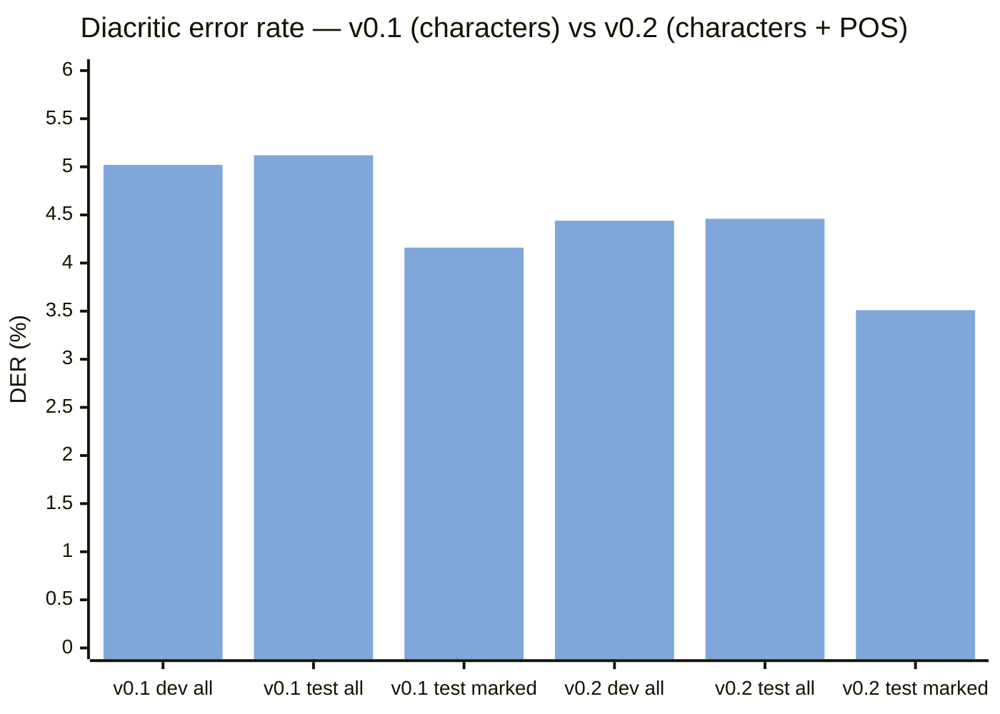

*Figure 11. The POS-conditioned model is better on every measure. On the
test split this is about 4,000 fewer mis-marked letters (≈ 31.0k → ≈ 27.0k
of 605k).*

Conditioning on POS removes ~13 % of remaining errors overall and ~16 % on
marked letters, at identical training cost. The mechanism we expect, from
Darwish et al. (2017) and from the design, is that the gain sits on case
endings and on unvocalized homographs (noun vs. verb readings) that character
context alone cannot resolve; a position-level breakdown (word-final vs.
word-internal letters) has not yet been computed and is part of the next
evaluation round. Because the tags are themselves silver (teacher → student →
features), the gain is a conservative estimate of what gold grammar would
provide.

> **In plain terms — how to read the two DER columns.** DER(all) says: "of
> every letter, how often did the model's mark disagree with the book's?"
> But the book leaves many letters bare on purpose, and the model is
> penalized for marking them. DER(marked) says: "of the letters the book
> *did* mark, how often did the model get the mark wrong?" The first is
> pessimistic, the second optimistic; the truth is in between — roughly
> 3.5–4.5 letters in a hundred for v0.2.

### 7.4 Size, cost and accuracy together

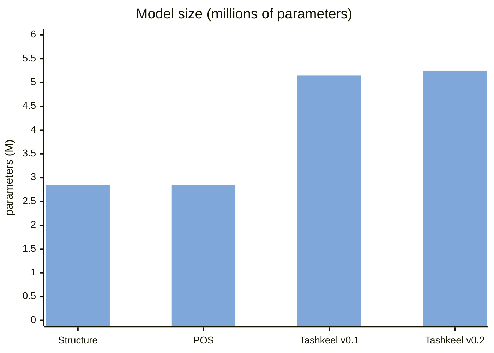

*Figure 12. All four models fit comfortably in CPU memory and on disk
(11–21 MB); the diacritizers are larger because their sequences are longer
and their per-position decision finer.*

The picture is consistent across tasks: where labels are plentiful and the
decision is local (structure: 10⁴–10⁵ examples, a boundary determined by a
few words of context), a small BiLSTM reaches the ceiling of its label
source; where the decision depends on syntax (case endings), adding an
explicit grammatical signal is worth more than adding parameters.

## 8. Deployment: Offline Annotation

### 8.1 Data flow

Models never run in the serving path. The `annotate` CLIs iterate over the
passages of an edition, run the model on the GPU workstation, and write one
row per passage into `passage_annotations (passage_id, layer, engine,
version, payload)`; older versions of the same layer are deleted so exactly
one version is live. Bulk runs over all Shamela editions are resumable
through an `etl_state` ledger and a per-passage "already annotated at this
version" check. Rows are pushed to production, where the API joins them at
read time (Figure 13).

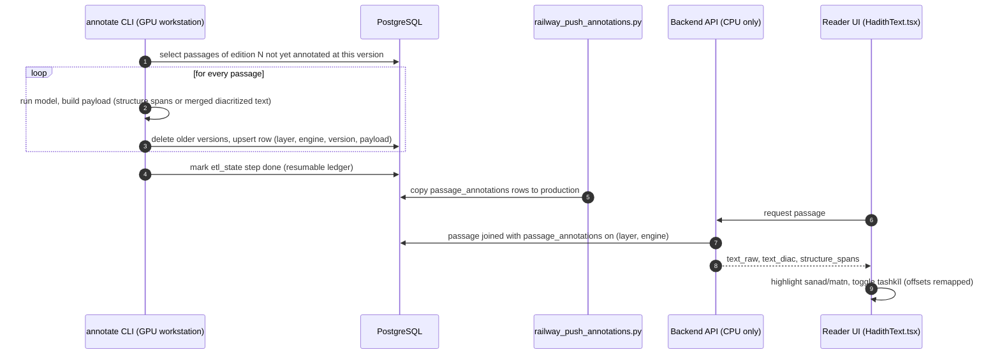

*Figure 13. Offline annotation and read-time serving. The serving tier is
CPU-only, deterministic and independent of GPU availability.*

Payloads: `layer='structure', engine='neural-indexing'` carries
`{"spans": [[start, end, label], …]}` in raw-text character offsets;
`layer='diacritized', engine='neural-tashkeel'` carries `{"text": …}`, the
merged vocalized passage.

### 8.2 Gap-only merge for tashkīl

Diacritization is applied conservatively. Words that already carry any
diacritic keep their original marks verbatim; Qurʾānic citation spans
(﴿…﴾ or {…}) are never altered; only fully bare words receive model output
(Figure 14). The bare words of a passage are diacritized together, in chunks
of ≤ 380 characters, so they retain sentence context.

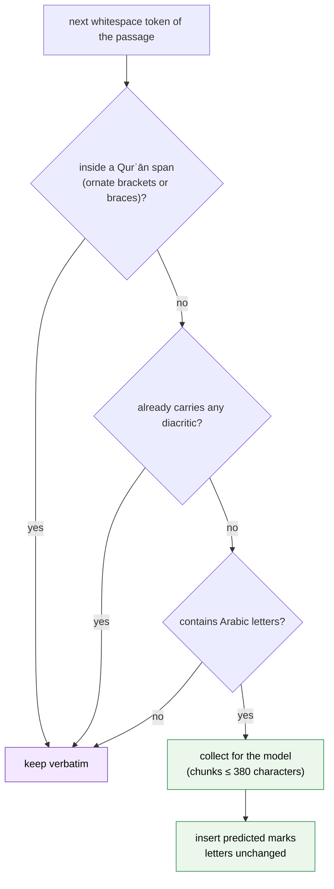

*Figure 14. Per-word merge policy. The editor's marks always win; the model
only fills gaps.*

### 8.3 Structure spans at page level

A Shamela *page* often contains several hadiths and headings, whereas
training units are single hadiths or single titles. At annotation time a
page is split into consecutive blocks of 220 words, each block is tagged
independently, and runs of equal labels are merged into spans. A page's
spans are stored only if the page really has hadith anatomy — at least 30
characters of `ISNAD` and 40 of `MATN` — and pages under 12 words are
skipped. These spans drive the reader's sanad/matn highlighting and fill
unit boundaries the rules missed (`ops/unitize_shamela.py --fill-sanad`).

### 8.4 Production status

At the time of writing, 230,689 diacritized passage annotations and neural
structure spans for the Shamela books are live on hadith.chat, powering the
reader's tashkīl toggle and sanad/matn highlighting and backfilling unit
boundaries.

## 9. Discussion

**Why small models work here.** The label sources are plentiful (10⁴–10⁵
examples per task) and the decisions are local: a two-level BiLSTM with a
character-level word encoder suffices to reach ceiling-adjacent accuracy on
structure, and competitive DER on selectively vocalized classical text,
while training in minutes and running without GPUs in production. With
character vocabularies the embedding tables are negligible (Tables 7–8), so
nearly all capacity is spent on context modeling, which is what these tasks
need.

**What the ablation shows.** Adding a 32-d grammatical signal per character
cut diacritization error by 13–16 % relative at fixed depth, width, data and
epochs. This is consistent with the long-standing finding that case endings
are the hard part of Arabic diacritization and that character context alone
cannot decide them. The signal is cheap because the POS student is itself a
2.85 M-parameter network with no external resources.

**What the numbers do not say.** Each headline figure is measured against
its label source. 99.96 % says the structure model reproduces the rules;
95.87 % says the POS student reproduces CAMeL; 4.46 % DER says the
diacritizer reproduces the editors' marks. These are the right first
questions for a system built on harvested labels, and they are answered
convincingly. The next questions — accuracy on rule-hostile pages, agreement
with gold POS, error on fully vocalized text — need small gold sets, which
the deployed models can help prioritize through their confidences.

## 10. Limitations

1. **Convention inheritance.** Structure accuracy is measured against
   rule-derived labels on rule-parseable units; the model inherits the
   rules' boundary convention, and its independent value on rule-hostile
   pages is assessed only qualitatively so far.
2. **Train/serve distribution shift for structure.** Training sequences are
   single units or single headings; production blocks are 220-word slices of
   pages containing several hadiths and headings in sequence, cut without
   overlap. The reported metrics do not measure multi-unit pages or block
   edges. Concatenating consecutive units into training sequences is a cheap
   remedy planned for the next version.
3. **Teacher-relative POS.** Agreement is with a context-free, MSA-database
   teacher whose backoff labels unknown words as proper nouns; the student's
   absolute accuracy on classical Arabic is unknown.
4. **Selective vocalization.** DER is computed on selectively vocalized
   references; DER(all) and DER(marked) bracket but do not pin down the true
   error. Fully vocalized subsets would enable a stricter evaluation.
5. **Near-duplicate leakage.** Splits are hashed on window text (tashkīl) or
   passage id (structure, POS). Identical strings cannot straddle splits,
   but the same hadith appears in several collections with small wording and
   vocalization differences, so near-duplicates can, which may make all test
   figures slightly optimistic.
6. **Context discontinuity in the merge.** At annotation time the
   diacritizer sees only the *bare* words of a passage concatenated, skipping
   already-vocalized words; where those are frequent the context is
   discontinuous, a small mismatch with training that could be removed by
   passing the full bare text and merging afterwards.
7. **Single runs.** All results are single-seed; variance across seeds was
   not measured, though the ablation shared data, splits and budget.
8. **Class inventory.** The superscript alif is not predicted (§2.2).

## 11. Future Work

The present models establish strong, cheap baselines and the data pipeline
that upgrades will reuse. Planned steps: CAMeLBERT-CA token classification
with LoRA (Hu et al., 2022) for structure, incrementally fine-tuned from
reviewed corrections; a ByT5-small benchmark for tashkīl; engine consensus
(Farasa, AlKhalil) as additional POS teachers; multi-unit training sequences
and overlapping blocks for page-level structure; a small gold set on
rule-hostile pages prioritized by model confidence; a position-level error
breakdown for tashkīl (case endings vs. word-internal marks) to test the
mechanism behind the v0.2 gain; and a fully vocalized evaluation subset for
diacritization.

## 12. Conclusion

Four compact neural models — structure segmentation, POS tagging, and two
diacritization variants — were trained entirely from labels the corpus
already contained, reach production-grade accuracy on held-out data
(99.96 % structure word accuracy; 95.87 % teacher agreement; 4.46 % DER),
train in 1–18 minutes each on a consumer GPU, and serve 659k classical
passages through an offline, versioned annotation architecture. The recipe —
rules as labeler, text as labeler, engine as labeler, plus a cheap
grammar-conditioning trick for tashkīl — transfers directly to other
classical-text digital libraries, and the measurement caveats spelled out
here transfer with it.

## Reproducibility

All components are runnable from the repository (run from `AdvancedHadith/`;
dataset generation needs the backend venv with PostgreSQL and camel-tools,
training needs the GPU venv):

```powershell
$env:PYTHONPATH = "<repo>\AdvancedHadith\Arabic-lib"

# datasets: corpus → JSONL (backend venv)
.venv\Scripts\python Arabic-lib\training\build_datasets.py --task all

# models (GPU venv)
Arabic-lib\.venv-gpu\Scripts\python -m arabiclib.neural.indexing train --epochs 3
Arabic-lib\.venv-gpu\Scripts\python -m arabiclib.neural.indexing eval
Arabic-lib\.venv-gpu\Scripts\python -m arabiclib.neural.pos      train --epochs 4
Arabic-lib\.venv-gpu\Scripts\python -m arabiclib.neural.pos      eval
Arabic-lib\.venv-gpu\Scripts\python -m arabiclib.neural.tashkeel train --epochs 3          # v0.1
Arabic-lib\.venv-gpu\Scripts\python -m arabiclib.neural.tashkeel tag-data                  # POS-tag windows
Arabic-lib\.venv-gpu\Scripts\python -m arabiclib.neural.tashkeel train --pos --epochs 3    # v0.2
Arabic-lib\.venv-gpu\Scripts\python -m arabiclib.neural.tashkeel eval [--pos]

# inference and offline annotation
Arabic-lib\.venv-gpu\Scripts\python -m arabiclib.neural.indexing infer --text "1248 - حدثنا ..."
Arabic-lib\.venv-gpu\Scripts\python -m arabiclib.neural.tashkeel infer --text "قال رسول الله" --pos
Arabic-lib\.venv-gpu\Scripts\python -m arabiclib.neural.indexing annotate --all-shamela
Arabic-lib\.venv-gpu\Scripts\python -m arabiclib.neural.tashkeel annotate --all-shamela --pos
```

Checkpoints embed their vocabularies, configuration, dev metrics and
version. Full engineering documentation: `docs/ARABICLIB_SERVICES_MODELS.md`;
metric provenance: `docs/MODELS_PERFORMANCE_REPORT.md`.

## Appendix A. Parameter budgets

A PyTorch LSTM layer with input size I and hidden size H has, per direction,
4H(I + H) weights and 8H biases, i.e. **4H(I + H + 2)** parameters;
bidirectional layers double it. Embeddings have V × d parameters; a linear
head has in × out + out.

```text
WordTagger (structure; V = 83 characters, T = 6 labels)
  character embedding      83 × 64                       =     5,312
  character BiLSTM         2 × 4·128·(64 + 128 + 2)      =   198,656
  word BiLSTM, layer 1     2 × 4·256·(256 + 256 + 2)     = 1,052,672
  word BiLSTM, layer 2     2 × 4·256·(512 + 256 + 2)     = 1,576,960
  head                     512 × 6 + 6                   =     3,078
  total                                                  = 2,836,678

WordTagger (POS; V = 71, T = 26)
  4,544 + 198,656 + 1,052,672 + 1,576,960 + 13,338       = 2,846,170

TashkeelNet v0.1 (V = 77 characters, 16 classes)
  character embedding      77 × 128                      =     9,856
  BiLSTM, layer 1          2 × 4·384·(128 + 384 + 2)     = 1,579,008
  BiLSTM, layer 2          2 × 4·384·(768 + 384 + 2)     = 3,545,088
  head                     768 × 16 + 16                 =    12,304
  total                                                  = 5,146,256

TashkeelPosNet v0.2 (adds a 24 × 32 tag embedding; layer-1 input 160)
  9,856 + 768 + 2 × 4·384·(160 + 384 + 2) + 3,545,088 + 12,304
  = 9,856 + 768 + 1,677,312 + 3,545,088 + 12,304        = 5,245,328
```

Stored in fp32, 2,836,678 parameters occupy 11.35 MB — the observed
checkpoint size, confirming that the checkpoints contain nothing beyond the
weights and small vocabularies.

## Appendix B. Label inventories

**Structure labels (model A).** `HNUM` printed hadith number · `ISNAD`
chain of transmitters · `MATN` report body · `HEADING` كتاب / باب / فصل
section title.

**POS tags (model C; the 24 CAMeL tags observed in the sample).**
`noun`, `verb`, `punc`, `noun_prop`, `prep`, `adj`, `abbrev`, `digit`,
`conj_sub`, `pron_rel`, `adv`, `part_neg`, `conj`, `pron_dem`,
`verb_pseudo`, `part_voc`, `pron`, `part_interrog`, `adv_interrog`, `part`,
`part_verb`, `adv_rel`, `pron_interrog`, `interj`.

**Diacritic classes (models B1, B2).** See Table 3: class = vowel index
(0 none, 1 fatḥa, 2 ḍamma, 3 kasra, 4 sukūn, 5 fatḥatān, 6 ḍammatān,
7 kasratān) + 8 if shadda.

## Appendix C. Glossary

| Term | Meaning in this paper |
|---|---|
| Hadith (ḥadīth) | a report of the words or deeds of the Prophet, transmitted through a chain of narrators |
| Isnād / sanad | the chain of transmitters that opens a hadith |
| Matn | the body of the report |
| Tashkīl (diacritization) | adding the short-vowel and shadda marks to Arabic letters |
| Case ending | the vowel on a word's last letter that encodes its grammatical role (subject, object, after a preposition) |
| Selectively vocalized | a print that marks only some letters, at the editor's discretion |
| Sequence labeling | predicting one class for every item of a sequence |
| BiLSTM | two LSTM networks reading a sequence in opposite directions, combined at each position |
| Character-level word encoder | a network that builds a word's vector from its letters instead of looking it up |
| OOV | out-of-vocabulary: a word never seen in training |
| Silver label | a label produced automatically (by rules, an engine or a model) rather than by a human |
| Weak supervision | training from silver labels |
| Distillation | training a small student model to imitate a teacher |
| Ablation | changing one factor while holding everything else fixed to measure its effect |
| DER | diacritic error rate — share of Arabic letters given the wrong mark class |
| Dev / test split | held-out data used for model selection / for the final, single evaluation |
| Gap-only merge | applying model output only where the source text has no marks |
| Checkpoint | a saved model file with weights, vocabularies and metadata |

## References

1. Abdelali, A., Darwish, K., Durrani, N., & Mubarak, H. (2016).  
   Farasa: A Fast and Furious Segmenter for Arabic. *NAACL 2016 (Demonstrations)*.

2. Belinkov, Y., & Glass, J. (2015).  
   Arabic Diacritization with Recurrent Neural Networks. *EMNLP 2015*.

3. Boella, M., Romani, F. R., Al-Raies, A., Solimando, C., & Lancioni, G. (2011).  
   The SALAH Project: Segmentation and Linguistic Analysis of Ḥadīth Arabic Texts. *AIRS 2011, LNCS 7097*.

4. Boudchiche, M., Mazroui, A., Ould Abdallahi Ould Bebah, M., Lakhouaja, A., & Boudlal, A. (2017).  
   AlKhalil Morpho Sys 2: A robust Arabic morpho-syntactic analyzer. *Journal of King Saud University — Computer and Information Sciences*, 29(2).

5. Darwish, K., Mubarak, H., & Abdelali, A. (2017).  
   Arabic Diacritization: Stats, Rules, and Hacks. *WANLP 2017*.

6. Fadel, A., Tuffaha, I., Al-Jawarneh, B., & Al-Ayyoub, M. (2019).  
   Neural Arabic Text Diacritization: State of the Art Results and a Novel Approach for Machine Translation. *WANLP 2019*.

7. Graves, A., & Schmidhuber, J. (2005).  
   Framewise Phoneme Classification with Bidirectional LSTM and Other Neural Network Architectures. *Neural Networks*, 18(5–6).

8. Harrag, F. (2014).  
   Text mining approach for knowledge extraction in Sahîh Al-Bukhari. *Computers in Human Behavior*, 30.

9. Hinton, G., Vinyals, O., & Dean, J. (2015).  
   Distilling the Knowledge in a Neural Network. *NIPS 2014 Deep Learning Workshop*; arXiv:1503.02531.

10. Hochreiter, S., & Schmidhuber, J. (1997).  
    Long Short-Term Memory. *Neural Computation*, 9(8).

11. Hu, E. J., Shen, Y., Wallis, P., Allen-Zhu, Z., Li, Y., Wang, S., Wang, L., & Chen, W. (2022).  
    LoRA: Low-Rank Adaptation of Large Language Models. *ICLR 2022*.

12. Inoue, G., Alhafni, B., Baimukan, N., Bouamor, H., & Habash, N. (2021).  
    The Interplay of Variant, Size, and Task Type in Arabic Pre-trained Language Models. *WANLP 2021*.

13. Lample, G., Ballesteros, M., Subramanian, S., Kawakami, K., & Dyer, C. (2016).  
    Neural Architectures for Named Entity Recognition. *NAACL 2016*.

14. Ling, W., Dyer, C., Black, A. W., Trancoso, I., Fermandez, R., Amir, S., Marujo, L., & Luís, T. (2015).  
    Finding Function in Form: Compositional Character Models for Open Vocabulary Word Representation. *EMNLP 2015*.

15. Loshchilov, I., & Hutter, F. (2019).  
    Decoupled Weight Decay Regularization. *ICLR 2019*.

16. Mubarak, H., Abdelali, A., Sajjad, H., Samih, Y., & Darwish, K. (2019).  
    Highly Effective Arabic Diacritization using Sequence to Sequence Modeling. *NAACL 2019*.

17. Obeid, O., Zalmout, N., Khalifa, S., Taji, D., Oudah, M., Alhafni, B., Inoue, G., Eryani, F., Erdmann, A., & Habash, N. (2020).  
    CAMeL Tools: An Open Source Python Toolkit for Arabic Natural Language Processing. *LREC 2020*.

18. Pasha, A., Al-Badrashiny, M., Diab, M., El Kholy, A., Eskander, R., Habash, N., Pooleery, M., Rambow, O., & Roth, R. (2014).  
    MADAMIRA: A Fast, Comprehensive Tool for Morphological Analysis and Disambiguation of Arabic. *LREC 2014*.

19. Paszke, A., et al. (2019).  
    PyTorch: An Imperative Style, High-Performance Deep Learning Library. *NeurIPS 2019*.

20. Ratner, A., Bach, S. H., Ehrenberg, H., Fries, J., Wu, S., & Ré, C. (2017).  
    Snorkel: Rapid Training Data Creation with Weak Supervision. *VLDB 2017*.

21. Xue, L., Barua, A., Constant, N., Al-Rfou, R., Narang, S., Kale, M., Roberts, A., & Raffel, C. (2022).  
    ByT5: Towards a Token-Free Future with Pre-trained Byte-to-Byte Models. *TACL*, 10.

22. Zitouni, I., Sorensen, J. S., & Sarikaya, R. (2006).  
    Maximum Entropy Based Restoration of Arabic Diacritics. *COLING-ACL 2006*.

